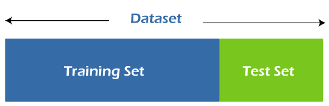
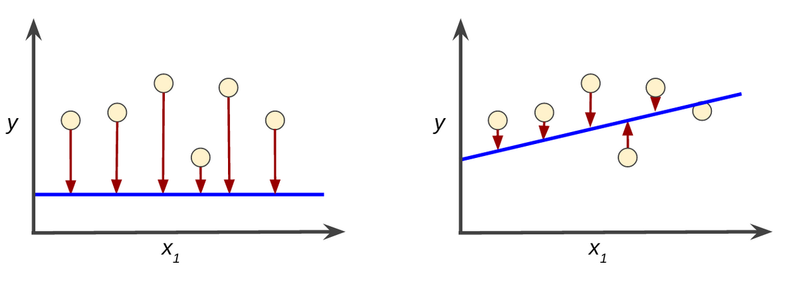
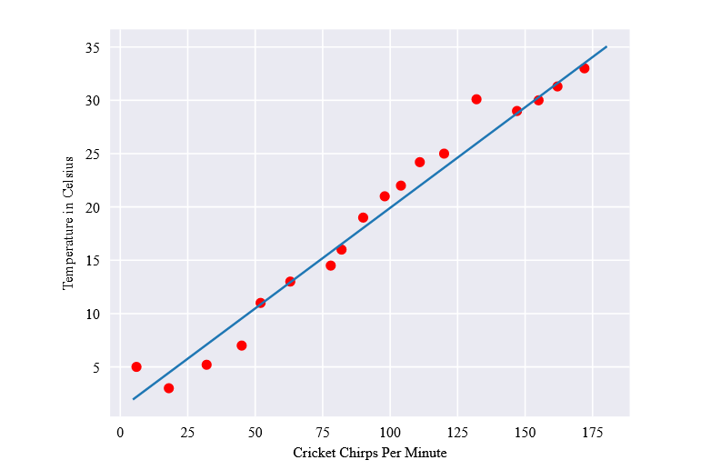

## Makine Öğrenimi Temelleri

Makine Öğrenimi, bilgisayarların verilere bakarak öğrenmelerini ve öğrenmedikleri veriler üzerinde tahminler yapmalarını sağlayan teknolojidir.
Örneğin bir fotoğraftaki köpeği tanımak ve sonraki fotoğraflarda köpek gördüğünde bunları tespit etmek için, bir metindeki duyguyu tahmin etmek için, bir banka işlemindeki sahtekarlığı tespit etmek için kullanılabilir.

Makineler öğrenirken giriş olarak aldığı verilere bağımsız değişkenler denir, ve bunların içerisindeki desenleri ortaya çıkarırken çeşitli algoritmalar kullanılır. 

Bu algoritmalar ve matematiksel tekniklerin bütününe model denir, ve modeli tahmin yapabilmesi için eğitmemiz gerekir. Verilerin bir kısmıyla model eğitimi yaptıktan sonra bir kısmıyla da test yapmamız gerekir.

Bu, sanki modeli cevaplarını bildiğimiz bir sınava sokmak gibidir. Örneğin elimizde 10 tane çözümlü sınav sorusu varsa biz 6 tane soruyu modele cevapları ile beraber öğretiriz. Kalan 4 soruyu da cevaplarını vermeden çözmesini bekleyebiliriz. Bu iki soru grubuna eğitim ve test seti adı verilir.

Bağımsız değişkenler genellikle `X` ile temsil edilir. Modelin tahmin etmeye çalıştığı değişkenlere de bağımlı değişken adı verilir ve bunlar `y` ile temsil edilir.

`Kayıp`, makinenin tahmin ettiği değer ile gerçek değer arasındaki farktır ve bunu minimize etmek isteriz. Örneğin aşağıdaki görselde sarı yuvarlaklar gerçek veri noktalarını, mavi çizgi bizim tahminimizi ve kırmızı oklar da kaybı temsil eder.

Model, eğitim esnasında bağımsız değişken olan sütünlara ağırlık verir ve bu ağırlıklara göre desenleri öğrenir.
Örneğin bir dondurma satışı verisinde mevsim ve mevcut sıcaklık sütunu çoğu zaman diğer sütunlardan daha önemli olacaktır.

Etiket, cevabını bildiğimiz bağımlı değişken veridir. Örneğin bir mail verisinde bulunan bazı maillerin spam olduğunu biliyoruz. Mailin spam olduğunu belirten sütuna etiket denir ve makine bu etiketi eğitim için kullanır.

Ancak her veride önceden etiketlenmiş veri olmayabilir, bu durumda da çalışan bazı algoritmalar vardır. Örneğin kümeleme algoritması etiketli veriye ihtiyaç duymasa da benzer verileri gruplandırıp bu şekilde tahminler gerçekleştirebilir.

Etiketli veri kullanılarak yapılan makine öğrenimine `denetimli makine öğrenimi` denir. Denetimli makine öğrenimin en temel algoritması `Lineer Regresyon`'dur.

Lineer Regresyon algoritması, elimizdeki verilere en uygun doğruyu oluşturmaya çalışır. Böylece belirli özelliklere sahip verilerin gidişatını önceden tahmin edebiliriz. Mesela aşağıdaki grafikte kırmızı noktalar gerçek veri noktalarıyken mavi çizgi bizim tahmin ettiğimiz matematiksel lineer regresyon doğrusudur.

Lineer Regresyon denklemi şu şekildedir: 

