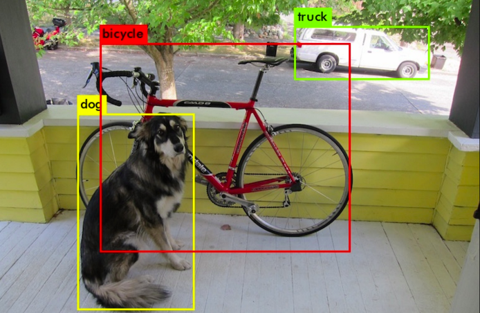

## Makine Öğrenimi Temelleri

Makine Öğrenimi, bilgisayarların verilere bakarak öğrenmelerini ve öğrenmedikleri veriler üzerinde tahminler yapmalarını sağlayan teknolojidir.
Örneğin bir fotoğraftaki köpeği tanımak ve sonraki fotoğraflarda köpek gördüğünde bunları tespit etmek için, bir metindeki duyguyu tahmin etmek için, bir banka işlemindeki sahtekarlığı tespit etmek için kullanılabilir.

Makineler öğrenirken giriş olarak aldığı verilere bağımsız değişkenler denir, ve bunların içerisindeki desenleri ortaya çıkarırken çeşitli algoritmalar kullanılır. 

Bu algoritmalar ve matematiksel tekniklerin bütününe model denir, ve modeli tahmin yapabilmesi için eğitmemiz gerekir. Verilerin bir kısmıyla model eğitimi yaptıktan sonra bir kısmıyla da test yapmamız gerekir.

Bu, sanki modeli cevaplarını bildiğimiz bir sınava sokmak gibidir. Örneğin elimizde 10 tane çözümlü sınav sorusu varsa biz 6 tane soruyu modele cevapları ile beraber öğretiriz. Kalan 4 soruyu da cevaplarını vermeden çözmesini bekleyebiliriz. Bu iki soru grubuna eğitim ve test seti adı verilir.

Bağımsız değişkenler genellikle `X` ile temsil edilir. Modelin tahmin etmeye çalıştığı değişkenlere de bağımlı değişken adı verilir ve bunlar `y` ile temsil edilir.
